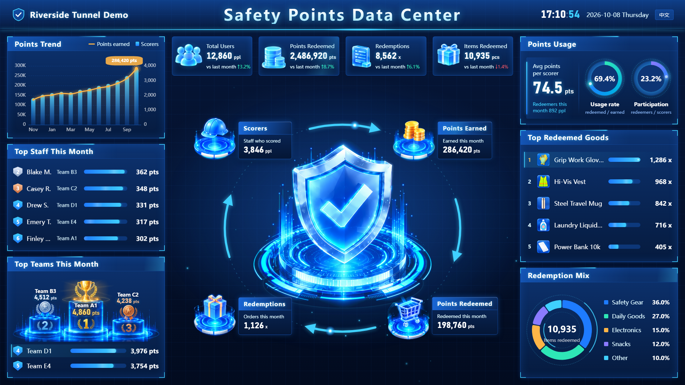
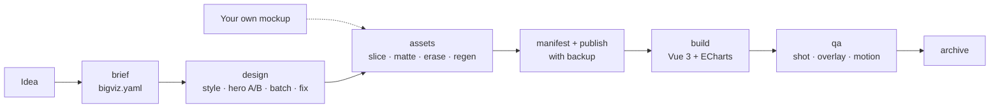

<div align="center">

# BigViz

**AI-crafted big-screen data dashboards — from one sentence to a production Vue 3 screen.**

[](LICENSE)
[](https://github.com/Amtb8788/BigViz/actions/workflows/ci.yml)
[](plugins/bigviz/skills)

English · [简体中文](README.zh-CN.md)

</div>

BigViz is a set of Agent Skills plus a small CLI that turns an idea like
*"a safety command center for a tunnel project"* into a polished 1920×1080 dashboard:
AI mockups you pick from, clean transparent 3D assets, and a real Vue 3 + ECharts page
whose layout matches the mockup.

- **Design like a studio.** Style shoot-outs, hero A/B tests, batch renders and targeted
  fix passes. You choose at every step.
- **Ship real code, not a screenshot.** Text, charts and panels are components. Only 3D
  objects become images.
- **Assets that survive production.** Row-wise matting, text erase, HD regen, a measured
  manifest and publish with automatic backup.
- **Verified visually.** Screenshots, overlays against the mockup and motion contact sheets.

## Showcase



*The example screen in `templates/vue3-echarts`, rendered at 1920×1080 with fictional data.
Editorial and aurora-glass showcases are coming.*

## 30-second quick start

**Claude Code**

```
/plugin marketplace add Amtb8788/BigViz
/plugin install bigviz@bigviz
```

Then:

```
/bigviz A safety points command center for a tunnel project, deep blue tech style
```

**Other agents (Cursor, Codex, and other Agent Skills tools)**

Copy the skill folders into your tool's skills directory:

```bash
git clone https://github.com/Amtb8788/BigViz
cp -r BigViz/plugins/bigviz/skills/* .agents/skills/     # or .cursor/skills/, ~/.codex/skills/
```

These tools follow the [Agent Skills](https://agentskills.io) standard, but paths differ.
Check your tool's docs for the exact location.

**Image provider**

```bash
export BIGVIZ_API_KEY=...          # any OpenAI-compatible Images API; never commit it
export BIGVIZ_BASE_URL=https://api.openai.com/v1
export BIGVIZ_MODEL=gpt-image-1
```

No key? Bring your own mockup and skip AI generation (see FAQ).

## CLI only

The skills drive the `bigviz` CLI. You can use it directly:

```bash
uvx --from "git+https://github.com/Amtb8788/BigViz#subdirectory=cli" bigviz doctor

bigviz init my-screen --preset deep-tech-blue --locale en
cd bigviz/my-screen
bigviz probe                                  # real returned sizes
bigviz prompt design
bigviz gen prompts/<file>.txt --tag v1 --n 4
bigviz sheet "designs/*-v1-*.png" -o shots/v1-sheet.png
bigviz slice && bigviz matte --ids center-hub
bigviz regen --jobs 3 && bigviz manifest
bigviz publish --app ../../my-app --name MyScreen
bigviz shot http://localhost:5173/ --dpr 2 -o shots/full.png
bigviz overlay shots/full.png designs/<final>.png --alpha 0.5
```

Full walkthrough: [docs/guide-quickstart.md](docs/guide-quickstart.md).

## Pipeline



| Skill | Does |
|---|---|
| [`bigviz`](plugins/bigviz/skills/bigviz/SKILL.md) | Orchestrates the phases, gates and your decisions |
| [`bigviz-brief`](plugins/bigviz/skills/bigviz-brief/SKILL.md) | Interviews you and writes `bigviz.yaml` |
| [`bigviz-design`](plugins/bigviz/skills/bigviz-design/SKILL.md) | Mockups: shoot-out, hero A/B, batch, fix, panel refine |
| [`bigviz-assets`](plugins/bigviz/skills/bigviz-assets/SKILL.md) | Cut list, matting, erase, HD regen, manifest, publish |
| [`bigviz-build`](plugins/bigviz/skills/bigviz-build/SKILL.md) | The Vue 3 page from the template and manifest |
| [`bigviz-qa`](plugins/bigviz/skills/bigviz-qa/SKILL.md) | Screenshots, overlays, motion sheets, checklist |

## Presets

| Preset | Look | Good for |
|---|---|---|
| `deep-tech-blue` (default) | Deep navy, cyan glow, glass panels, 3D isometric icons | Command centers, smart-city and construction cockpits |
| `editorial-dark` | Restrained dark UI, thin rules, typographic hierarchy (Bloomberg / Linear feel) | Executive and finance dashboards |
| `aurora-glass` | Light-on-dark glassmorphism, colourful accents | Product launches, marketing walls |

Presets live in `cli/src/bigviz/presets/*.yaml`: a palette, fonts and prompt fragments.
Override colours per screen with `style.palette` in `bigviz.yaml`.

## Template

[`templates/vue3-echarts`](templates/vue3-echarts) is a standalone Vite + Vue 3 + TS +
ECharts 5 screen with no UI library. Its `src/screen/` kit (`BigScreen`, `ScreenPanel`,
`ScreenChart`, `RankList`, `CountUp`, `KpiCards`, `HeroHub`, `motion.ts`) can be dropped
into an existing app. It scales with CSS `zoom` for crisp text, sets the ECharts DPR from the
zoom, animates only transform/opacity and respects reduced motion.

## Example

[`examples/safety-points`](examples/safety-points) is a complete, fictional spec with six
panels, three hero variants and a cut list.

## FAQ

**Which image model?** Any OpenAI-compatible Images API with generate and edit endpoints.
The default is `gpt-image-1`; set `BIGVIZ_MODEL` and `BIGVIZ_BASE_URL` for others or for a
proxy.

**What does a screen cost?** It depends on your provider's pricing. A typical run is a style
shoot-out (6–9 images), a hero A/B (2–3), a final batch (4–7), 1–3 fix edits, and one regen
per asset. Use `--n` and `--quality` to control spend; `bigviz probe` uses tiny low-quality
requests.

**Why is the mockup smaller than 1920×1080?** Image APIs cap resolution, and some proxies
ignore `size` entirely. `bigviz probe` records what you really get. The mockup is for layout;
text and charts are rendered by code, and 3D assets are regenerated in HD with `bigviz regen`.

**The model garbles my text, especially Chinese.** List risky strings under `pitfalls`,
batch 4–7 renders and pick the most accurate, then run a "keep everything, fix only" edit.
On the page all text comes from the spec, so it is always exact.

**No API key, or I already have a design?** Bring your own mockup: put it in `designs/`,
set `design.final`, set `regen: false` on assets, and use `slice`, `matte`, `manifest` and
`publish`. None of those call the API.

**Does it work without Claude Code?** Yes. The skills are plain Agent Skills folders and the
CLI works on its own.

## Roadmap

- [ ] React template
- [ ] More presets
- [ ] Optional local super-resolution for assets (instead of or after regen)

## Contributing

See [CONTRIBUTING.md](CONTRIBUTING.md). All content must be original work; no vendored
prompt libraries.

## License

[MIT](LICENSE) © Amtb8788
