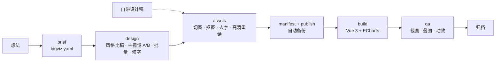

<div align="center">

# BigViz

**AI 打造的数据可视化大屏——从一句话到可上线的 Vue 3 大屏。**

[](LICENSE)
[](https://github.com/Amtb8788/BigViz/actions/workflows/ci.yml)
[](plugins/bigviz/skills)

[English](README.md) · 简体中文

</div>

BigViz 是一组 Agent Skills 加一个轻量 CLI。一句"给隧道项目做个安全积分指挥中心"，
就能产出精致的 1920×1080 数据大屏：可挑选的 AI 设计稿、干净透明的 3D 素材，以及与设计稿
布局一致的真实 Vue 3 + ECharts 页面。

- **像设计工作室一样出稿。** 风格比稿、主视觉 A/B、批量出图、定点修字，每一步由你来选。
- **交付真代码，不是截图。** 文字、图表、面板都是组件，只有 3D 物件才是图片。
- **素材经得起上线。** 逐行背景估计抠图、去除烘焙文字、AI 高清重绘、尺寸清单、带自动备份的发布。
- **用图验证。** 全屏与面板截图、与设计稿叠图对比、动效帧拼图。

## 效果展示


*`templates/vue3-echarts` 自带的示例大屏，1920×1080 渲染，数据均为虚构。克制编辑风、极光玻璃两套风格的展示图后续补上。*

## 30 秒上手

**Claude Code**

```
/plugin marketplace add Amtb8788/BigViz
/plugin install bigviz@bigviz
```

然后：

```
/bigviz 给隧道项目做一个安全积分指挥中心大屏，深蓝科技风，中文
```

**其他代理（Cursor、Codex 等支持 Agent Skills 的工具）**

把技能文件夹复制到工具的技能目录：

```bash
git clone https://github.com/Amtb8788/BigViz
cp -r BigViz/plugins/bigviz/skills/* .agents/skills/     # 或 .cursor/skills/、~/.codex/skills/
```

这些工具遵循 [Agent Skills](https://agentskills.io) 标准，但目录各不相同，请以所用工具的文档为准。

**图像服务**

```bash
export BIGVIZ_API_KEY=...          # 任意 OpenAI 兼容的 Images API；切勿提交到仓库
export BIGVIZ_BASE_URL=https://api.openai.com/v1
export BIGVIZ_MODEL=gpt-image-1
```

没有 Key？自带设计稿，跳过 AI 出图（见常见问题）。

## 只用 CLI

技能驱动的是 `bigviz` CLI，也可以直接使用：

```bash
uvx --from "git+https://github.com/Amtb8788/BigViz#subdirectory=cli" bigviz doctor

bigviz init my-screen --preset deep-tech-blue --locale zh
cd bigviz/my-screen
bigviz probe                                  # 实际返回的分辨率
bigviz prompt design
bigviz gen prompts/<file>.txt --tag v1 --n 4
bigviz sheet "designs/*-v1-*.png" -o shots/v1-sheet.png
bigviz slice && bigviz matte --ids center-hub
bigviz regen --jobs 3 && bigviz manifest
bigviz publish --app ../../my-app --name MyScreen
bigviz shot http://localhost:5173/ --dpr 2 -o shots/full.png
bigviz overlay shots/full.png designs/<final>.png --alpha 0.5
```

完整流程见 [docs/guide-quickstart.md](docs/guide-quickstart.md)（英文）。

## 流水线



| 技能 | 作用 |
|---|---|
| [`bigviz`](plugins/bigviz/skills/bigviz/SKILL.md) | 编排各阶段、门禁检查和你的决策点 |
| [`bigviz-brief`](plugins/bigviz/skills/bigviz-brief/SKILL.md) | 访谈需求，写出 `bigviz.yaml` |
| [`bigviz-design`](plugins/bigviz/skills/bigviz-design/SKILL.md) | 设计稿：比稿、主视觉 A/B、批量、修字、面板精修 |
| [`bigviz-assets`](plugins/bigviz/skills/bigviz-assets/SKILL.md) | 切图清单、抠图、去字、高清重绘、清单、发布 |
| [`bigviz-build`](plugins/bigviz/skills/bigviz-build/SKILL.md) | 基于模板和素材清单实现 Vue 3 页面 |
| [`bigviz-qa`](plugins/bigviz/skills/bigviz-qa/SKILL.md) | 截图、叠图、动效拼图、验收清单 |

## 预设风格

| 预设 | 观感 | 适用场景 |
|---|---|---|
| `deep-tech-blue`（默认） | 深藏蓝、青色光效、玻璃面板、3D 等距图标 | 指挥中心、智慧城市、智慧工地驾驶舱 |
| `editorial-dark` | 克制的深色界面、细线、以排版建立层级（Bloomberg / Linear 风） | 管理层与金融看板 |
| `aurora-glass` | 深色底上的玻璃拟态、多彩点缀 | 发布会、营销展示墙 |

预设位于 `cli/src/bigviz/presets/*.yaml`，包含配色、字体和提示词片段。
单个大屏可在 `bigviz.yaml` 的 `style.palette` 中覆盖颜色。

## 模板

[`templates/vue3-echarts`](templates/vue3-echarts) 是独立的 Vite + Vue 3 + TS + ECharts 5
大屏工程，不依赖 UI 库。其中 `src/screen/` 套件（`BigScreen`、`ScreenPanel`、`ScreenChart`、
`RankList`、`CountUp`、`KpiCards`、`HeroHub`、`motion.ts`）可直接嵌入已有项目。它用 CSS `zoom`
缩放以保证文字清晰，按缩放比设置 ECharts DPR，只对 transform/opacity 做动画，并支持减弱动效。

## 示例

[`examples/safety-points`](examples/safety-points) 是一份完整的虚构数据 spec，包含六个面板、
三个主视觉方案和切图清单。

## 常见问题

**用哪个图像模型？** 任意支持生成和编辑接口的 OpenAI 兼容 Images API。默认 `gpt-image-1`，
可通过 `BIGVIZ_MODEL` 和 `BIGVIZ_BASE_URL` 切换模型或代理。

**做一张大屏要花多少钱？** 取决于服务商定价。一次典型流程：风格比稿 6–9 张、主视觉 A/B 2–3 张、
定稿批量 4–7 张、修字编辑 1–3 次，每个素材一次重绘。用 `--n` 和 `--quality` 控制开销；
`bigviz probe` 只发极小的低质量请求。

**为什么设计稿小于 1920×1080？** 图像接口有分辨率上限，部分代理会直接忽略 `size`。
`bigviz probe` 会记录真实返回的尺寸。设计稿只用来定布局：文字和图表由代码渲染，
3D 素材通过 `bigviz regen` 高清重绘。

**模型总把文字写错，尤其是中文。** 把易错字符串写进 `pitfalls`，批量出 4–7 张挑最准的，
再用"其余保持不变，只修正：……"做一次编辑修字。页面上的文字全部来自 spec，一定准确。

**没有 API Key，或者已经有设计稿？** 自带设计稿：放进 `designs/`，设置 `design.final`，
素材设 `regen: false`，然后用 `slice`、`matte`、`manifest`、`publish`，这些命令都不调用接口。

**不用 Claude Code 能用吗？** 能。技能是标准的 Agent Skills 文件夹，CLI 也可独立使用。

## 路线图

- [ ] React 模板
- [ ] 更多预设风格
- [ ] 可选的本地超分辨率（替代重绘或在重绘后使用）

## 参与贡献

见 [CONTRIBUTING.md](CONTRIBUTING.md)（英文）。所有内容必须为原创，不得引入第三方提示词库。

## 许可证

[MIT](LICENSE) © Amtb8788
